 

 

 

---

## 🔹 About & Vision

I am a BSCS Student at FAST-NUCES Karachi, building a strong foundation for a career in **Full-Stack Development and DevOps / Platform Engineering**. My philosophy is simple: *to build and automate highly scalable infrastructure, you must first master the software that runs on it.*

Instead of jumping straight into orchestration tools without context, I am deliberately spending my early years mastering systems programming, operating systems, and data structures - while in parallel building production-grade web applications on the **MERN/PERN** and **ASP.NET Core** stacks.

Every project here reflects a journey from first principles: moving intentionally from raw code to containerized deployment.

---

## 🟢 Education

**BS Computer Science - FAST-NUCES Karachi**

| Area | Coursework |
|---|---|
| Systems & Ops | Operating Systems, Computer Organization & Assembly, Digital Logic, Software Engineering |
| Programming & Dev | Data Structures & Algorithms, OOP, Database Systems, Web Development |
| Mathematics & AI | Linear Algebra, Calculus, Probability & Statistics, Theory of Automata, AI Fundamentals |

---

## 🟣 Tech Stack

**Languages & Core Systems** 

**Full-Stack Development** 

**Databases** 

**Learning Stack - DevOps & Platform** 

---

## 🟢 Work

Projects grouped by the domain they demonstrate - the throughline is core systems reasoning applied to increasingly full-stack problems.

#### 🧠 Graph Theory & Data Structures
**[SocioNET++](https://github.com/AbdurRehmanKhan-ARK/SocioNet-Plus-Plus)**
`C++17` `Graph Theory` `Suffix Automaton` `Custom File I/O`
Console-based social network engine modeling friend relationships as directed graphs. BFS-powered mutual-friend discovery, interest-weighted suggestion scoring, O(n) suffix-automaton username search, and a custom alphabetically-partitioned binary storage layer with O(log n) retrieval. Zero external dependencies.

#### 🌐 Web Development & Full-Stack Engineering
**[OmniFlex](https://github.com/AbdurRehmanKhan-ARK/Omni-Flex)**
`ASP.NET Core MVC` `SQL Server` `Role-Based Auth`
University academic management system orchestrating students, courses, enrollments, grades, and faculty operations across four distinct authorization roles. Built collaboratively through a structured Git branching workflow.

#### ⚙️ Operating Systems 
**[Producer-Consumer-POSIX](https://github.com/AbdurRehmanKhan-ARK/Producer-Consumer-POSIX)**
`C` `POSIX Threads` `Semaphores & Mutexes`
Airport baggage-handling simulation implementing the bounded-buffer producer-consumer problem at the systems level. Threads coordinated via mutex and dual semaphore primitives, with graceful shutdown propagated through a sentinel token.

#### 🔌 Digital Logic Design
**[6-Bit ALU](https://github.com/AbdurRehmanKhan-ARK/6-Bit-ALU)**
`Logisim` `Combinational Logic`
Fully functional Arithmetic Logic Unit built from primitive gates, spanning sixteen operations across arithmetic, logical, shift, comparison, and utility categories. Built for the Digital Logic Design course.

---

## 🟡 Currently Learning

Structured, in-progress learning repos - tracked commit-by-commit as I build alongside courses/series, rather than finished portfolio pieces.

**[Backend-Journey](https://github.com/AbdurRehmanKhan-ARK/Backend-Journey)**
`Node.js` `Express` `MongoDB` `Mongoose` `JWT`
Concept-by-concept backend learning log following the Chai aur Code series - isolated practice files per topic, plus an actual fullstack deployment project and an in-progress YouTube-style capstone (`Mega-Project`).

**[JavaScript-Tutorials](https://github.com/AbdurRehmanKhan-ARK/JavaScript-Tutorials)**
`JavaScript` `V8 Internals`
JS fundamentals through V8 internals - 20 modules, 74 files.

**[Learning-DevOps](https://github.com/AbdurRehmanKhan-ARK/Learning-DevOps)**
`Docker` `Kubernetes` `CI/CD`
Docker, Linux, Kubernetes, and CI/CD practice - ties into the DevOps tools already listed in Tech Stack above.

---

## 🤝 Connect With Me

Open to technical discussions, project collaborations, and feedback on my work. Whether you've spotted an issue in one of my repos, have a better approach to share, or just want to talk systems and engineering - feel free to reach out.

---

## 🔵 GitHub Metrics

  

<picture>
  <source media="(prefers-color-scheme: dark)" srcset="https://raw.githubusercontent.com/AbdurRehmanKhan-ARK/AbdurRehmanKhan-ARK/output/github-contribution-grid-snake-dark.svg">
  <source media="(prefers-color-scheme: light)" srcset="https://raw.githubusercontent.com/AbdurRehmanKhan-ARK/AbdurRehmanKhan-ARK/output/github-contribution-grid-snake.svg">
  
</picture>

 

✦ &nbsp; ***"Work finishes by starting." - a masterpiece of wisdom from my grade 6 teacher*** &nbsp; ✦

 

🚀 &nbsp; ***For me this is the most effective answer to analysis paralysis - in engineering, and in life.*** &nbsp; 🚀

 

