 

 

 

---

## 🔹 About & Vision

I am a CS Sophomore at FAST NUCES Karachi, building a strong foundation for a career in **Full-Stack Development and DevOps Engineering**. My philosophy is simple: *To build and automate highly scalable infrastructure, you must first master the software that runs on it.*

Instead of jumping straight into complex orchestration tools without context, I am deliberately spending my early years mastering systems programming, operating systems, and data structures. Currently, I am expanding my **Development (Dev)** foundations by building production-grade web applications using the **MERN/PERN** and **ASP.NET Core** stacks.

Every project here reflects a journey from first principles - moving intentionally from raw code to containerized deployment.

---

## 🟢 Education

**BS Computer Science | FAST NUCES Karachi**

| Area | Coursework |
|------|------------|
| Systems & Ops | Operating Systems, Computer Organization & Assembly, Digital Logic, Software Engineering |
| Programming & Dev | Data Structures & Algorithms, Object-Oriented Programming, Database Systems, Web Dev |
| Mathematics & AI | Linear Algebra, Calculus, Probability & Statistics, Theory of Automata, AI Fundamentals |

---

## 🟣 Tech Stack

### Languages & Core Systems

### Full-Stack Development

### Databases

### Learning Stack

---

## 🟢 Work

Projects organized by the domain they demonstrate, showcasing the transition from core systems to full-stack engineering.

**Graph Theory & Data Structures**

[SocioNET++](https://github.com/AbdurRehmanKhan-ARK/SocioNet-Plus-Plus) ***=>*** Console-based social network engine modeling friend relationships as directed graphs. BFS-powered mutual friend discovery, interest-weighted suggestion scoring, Suffix Automaton username search at O(n), and a custom alphabetically-partitioned binary file storage layer with O(log n) retrieval. Zero external dependencies.

**Web Development & Full-Stack Engineering**

[OmniFlex](https://github.com/AbdurRehmanKhan-ARK/Omni-Flex) ***=>*** A university academic management system engineered on ASP.NET Core MVC. Orchestrates students, courses, enrollments, grades, and faculty operations across four distinct authorization roles. Developed collaboratively through a structured Git branching workflow.

**Operating Systems & Concurrency**

[Producer-Consumer-POSIX](https://github.com/AbdurRehmanKhan-ARK/Producer-Consumer-POSIX) ***=>*** Airport baggage handling simulation implementing the bounded-buffer producer-consumer problem at the systems level in C. POSIX threads coordinated via mutex and dual semaphore primitives. Graceful shutdown propagated through a sentinel token. This project cemented my understanding of how low-level system processes interact.

**Digital Logic & Hardware Design**

[6-Bit ALU](https://github.com/AbdurRehmanKhan-ARK/6-Bit-ALU) ***=>*** Fully functional Arithmetic Logic Unit constructed from primitive gates in Logisim. Sixteen operations spanning arithmetic, logical, shift, comparison, and utility categories. Built for the Digital Logic Design course.

---

## 🟠 Current Focus & Roadmap

**Dev Mastery:** Deepening proficiency in the **MERN** and **PERN** stacks to understand complex backend architectures, microservices, and database optimizations.

**DevOps Foundations:** Moving projects from "works on my machine" to isolated environments using **Docker**, while exploring automated workflows via **GitHub Actions**.

**Algorithmic Discipline:** Maintaining continuous problem-solving practice through structured competitive programming.

---

## 🤝 Connect With Me

I am open to technical discussions, project collaborations, and any feedback on my work. Whether you have spotted an issue in one of my repositories, have a better approach to share, or simply want to talk systems and engineering - feel free to reach out.

---

## 🔵 GitHub Metrics

  

<picture>
  <source media="(prefers-color-scheme: dark)" srcset="https://raw.githubusercontent.com/AbdurRehmanKhan-ARK/AbdurRehmanKhan-ARK/output/github-contribution-grid-snake-dark.svg">
  <source media="(prefers-color-scheme: light)" srcset="https://raw.githubusercontent.com/AbdurRehmanKhan-ARK/AbdurRehmanKhan-ARK/output/github-contribution-grid-snake.svg">
  
</picture>

  

---

 

> **"Work finishes by starting" (wisdom by my grade 6 teacher)**

The most effective answer to analysis paralysis - in engineering, and in life.

 

