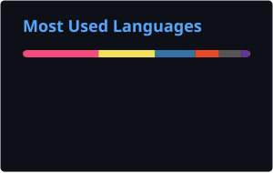

---

## 🔹 About

I am a Computer Science undergraduate at **FAST-NUCES Karachi**, building toward a career in **Full-Stack Development and Platform Engineering**.

My approach is grounded in first principles: understand the software before automating the infrastructure around it. I combine systems programming, operating systems, and data structures with practical application development using **MERN** and **ASP.NET Core**.

Across these projects, my priorities are correctness, testability, reproducible results, and clear engineering decisions. Containers and delivery automation are the next layer of that foundation, not a substitute for it.

## 🧩 Selected Work

### [SocioNET++](https://github.com/AbdurRehmanKhan-ARK/SocioNet-Plus-Plus)

`C++17` `Graph Theory` `Suffix Automaton` `Binary File I/O`

A console-based social-network engine built without external dependencies.

- Models relationships as directed graphs, with BFS-based mutual-friend discovery and interest-weighted recommendations.
- Implements suffix-automaton username search and a custom, alphabetically partitioned binary storage layer.

### [Chronic Wound Fusion](https://github.com/AbdurRehmanKhan-ARK/chronic-wound-fusion)

`Python` `PyTorch` `Transfer Learning` `Statistical Evaluation`

Research implementation extending a published chronic-wound classification study.

- Combines three CNN backbones through a gated decision-level fusion head.
- Uses group-aware cross-validation, MD5 integrity audits, and seeded runs to strengthen evaluation integrity and reproducibility.
- Reported **79.28% test accuracy**, compared with a **73.87% reference baseline**, with 95% confidence intervals and ablation analysis.

### [OmniFlex](https://github.com/AbdurRehmanKhan-ARK/Omni-Flex)

`ASP.NET Core MVC` `C#` `SQL Server` `Role-Based Authorization`

A collaboratively developed university academic-management application.

- Covers student, course, enrollment, grade, and faculty workflows across **four authorization roles**.
- Developed through a structured Git branching workflow for coordinated team contributions.

### [Producer Consumer POSIX](https://github.com/AbdurRehmanKhan-ARK/Producer-Consumer-POSIX)

`C` `POSIX Threads` `Mutexes` `Semaphores`

An airport baggage-handling simulation implementing the bounded-buffer producer-consumer problem.

- Coordinates concurrent threads through a mutex and two semaphores.
- Propagates orderly shutdown through a sentinel token.

### [6-Bit ALU](https://github.com/AbdurRehmanKhan-ARK/6-Bit-ALU)

`Logisim` `Combinational Logic` `Digital Design`

A six-bit arithmetic logic unit constructed from primitive gates for a Digital Logic Design course project. Supports **16 operations** across arithmetic, logic, shifts, comparisons, and utility functions.

### [Computer Networks Proxy Server](https://github.com/MuhammadTalhaAamir028/Computer-Networks-proxy-server) -  In Progress

`Python` `Observability` `Automated Testing` `Load Testing`

A team project in which my contribution focuses on observability and validation tooling.

- Implemented thread-safe statistics counters and a non-blocking JSON-lines logger.
- Built HTTP origin and TLS echo tooling, smoke checks, and load-test reporting with latency percentiles, CSV output, and breaking-point detection.
- Local Phase 1 validation on `feat/obs`: **97 passing tests** and **95.5% coverage for `proxy.obs`**. Merged-build validation remains pending.

## 🛠️ Technical Stack

<strong>Languages and Core Systems</strong> 

<strong>Full-Stack Development</strong> 

<strong>Databases</strong> 
 
SQL Server is also used in OmniFlex.

<strong>Learning Track: Containers and CI/CD</strong> 

## 🎓 Education

**BS Computer Science -  FAST National University of Computer and Emerging Sciences, Karachi**

| Area | Academic Focus |
|---|---|
| Systems and Architecture | Operating Systems, Computer Organization and Assembly, Digital Logic, Theory of Automata |
| Software Development | Data Structures and Algorithms, Object-Oriented Programming, Database Systems, Software Engineering, Web Development |
| Mathematics and AI | Linear Algebra, Calculus, Probability and Statistics, AI Fundamentals |

## 📚 Currently Learning

Structured learning repositories documenting ongoing study and implementation exercises rather than completed portfolio products.

**[Backend Journey](https://github.com/AbdurRehmanKhan-ARK/Backend-Journey)**  
`Node.js` `Express` `MongoDB` `Mongoose` `JWT`

Topic-by-topic backend practice following the Chai aur Code series. Includes isolated exercises, a deployed full-stack project, and an in-progress YouTube-style backend capstone.

**[JavaScript Tutorials](https://github.com/AbdurRehmanKhan-ARK/JavaScript-Tutorials)**  
`JavaScript` `V8 Internals`

Structured study of JavaScript fundamentals and V8 internals, organized across 20 modules.

**[Learning DevOps](https://github.com/AbdurRehmanKhan-ARK/Learning-DevOps)**  
`Linux` `Docker` `Kubernetes` `CI/CD`

Hands-on exercises connecting container and delivery tooling to practical implementation.

## 📊 GitHub Activity

Contribution graph

 

<picture>
  <source media="(prefers-color-scheme: dark)" srcset="https://raw.githubusercontent.com/AbdurRehmanKhan-ARK/AbdurRehmanKhan-ARK/output/github-contribution-grid-snake-dark.svg" />
  <source media="(prefers-color-scheme: light)" srcset="https://raw.githubusercontent.com/AbdurRehmanKhan-ARK/AbdurRehmanKhan-ARK/output/github-contribution-grid-snake.svg" />
  
</picture>

## 🤝 Connect

Open to technical discussions, project collaborations, and constructive feedback on my work. Reach me through [LinkedIn](https://www.linkedin.com/in/abdur-rehman-khan-999198320/) or [email](mailto:abdurrehmankhan0909@gmail.com).

---

<em>“Work finishes by starting.”</em> 
A principle from my grade 6 teacher that I still apply.

